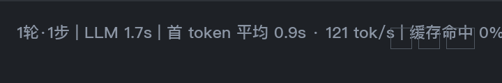

<p align="center">
  <a href="#en"></a>
  <a href="#zh"></a>
</p>

---

<a name="en"></a>

# DSH Stats Line

A Hermes Desktop **statusbar plugin** that shows a live per-turn usage line —
inspired by the bottom stats line of [anywhere-labs/dsh-desktop](https://github.com/anywhere-labs/dsh-desktop).
Click the language badge above to switch to 中文.



## What it looks like

Centered on the window's bottom statusbar:

```
1 turn·1 step | LLM 1.7s | TTFT avg 0.9s · 121 tok/s | Cache 0% | In 7.8K tok · Out 102 tok
```

No session data yet → shows a sample line. After you send a message it switches
to **real numbers** and live-updates while streaming. Hover for a tooltip, click
for the raw usage payload.

## Install

### One-click (recommended)

Make sure the Hermes desktop app is running, then click:

<p align="center">
<a href="hermes://plugin/install?repo=qq1131909103/dsh-stats-line&enable=1"></a>
</p>

The app detects this repo as a **desktop plugin**, shows a confirmation dialog,
and installs it into `desktop-plugins/dsh-stats-line/`. That's it.

### Manual

1. `git clone https://github.com/qq1131909103/dsh-stats-line.git` (or download the ZIP)
2. Copy `plugin.js` so you have `<hermes home>/desktop-plugins/dsh-stats-line/plugin.js`
   (`<hermes home>` is `~/.hermes`, or `~/.hermes/profiles/<name>` under a named profile —
   check **Settings → Plugins** for the exact folder path on your machine.)
3. In the desktop app press `Ctrl+K` → **Reload desktop plugins**.

## How it works

Reads the live `UsageStats` of the focused session through the plugin SDK
(`host.state.focusedUsage` — `input` / `output` / `calls` / `avg_tps` /
`cache_hit_pct`), subscribes to `busy` / `awaitingResponse` for locally-timed
LLM / time-to-first-token measurements, and renders every group with real values —
falling back to sample values only until real data arrives, so the line never
collapses mid-stream.

Because the statusbar only exposes `left`/`right` clusters, the plugin centers
itself with a `fixed` overlay that tracks the statusbar (ResizeObserver) — it
never displaces or blocks the native items (approval mode, model, terminal…).

## Uninstall

**Settings → Plugins** → find **DSH 同款统计行** → Disable, or remove the folder.

## License

MIT

---

<a name="zh"></a>

# DSH 同款统计行

一个 Hermes 桌面端**状态栏插件**：实时显示每轮对话的用量统计行，灵感来自
[anywhere-labs/dsh-desktop](https://github.com/anywhere-labs/dsh-desktop) 底部那行小字。
点击上方英文徽章可切换到 English。


## 效果

居中显示在窗口最底部的状态栏上：

```
1轮·1步 | LLM 1.7s | 首 token 平均 0.9s · 121 tok/s | 缓存命中 0% | 输入 7.8K tok · 输出 102 tok
```

- 还没有会话数据时 → 显示上面的示例行；
- 点发送之后 → 切换为**真实数据**，流式输出时实时刷新（输入/输出 token、吞吐、缓存命中率一路跳动）；
- 鼠标悬停显示提示，点击可查看原始用量数据。

## 安装

### 一键安装（推荐）

先启动 Hermes 桌面端，然后点击：

<p align="center">
<a href="hermes://plugin/install?repo=qq1131909103/dsh-stats-line&enable=1"></a>
</p>

Hermes 会自动识别本仓库为**桌面插件**，弹出确认框，装进你的 `desktop-plugins/dsh-stats-line/`，
完成。

### 手动安装

1. `git clone https://github.com/qq1131909103/dsh-stats-line.git`（或下载 ZIP）
2. 把 `plugin.js` 复制到 `<Hermes 主目录>/desktop-plugins/dsh-stats-line/plugin.js`
   （主目录一般是 `~/.hermes`；用了命名配置则为 `~/.hermes/profiles/<名字>`——在
   桌面端 **设置 → 插件** 里能看到确切路径）
3. 桌面端按 `Ctrl+K` → **重新加载桌面插件**

## 工作原理

通过插件 SDK 订阅当前会话的实时用量（`host.state.focusedUsage`：输入/输出 token、
步数 `calls`、吞吐 `avg_tps`、缓存命中率 `cache_hit_pct`），并监听 `busy` /
`awaitingResponse` 在本地实测 LLM 耗时与首 token 延迟。每组数值只在拿到真数据前
显示示例值，流式过程中整行不会塌陷。

由于状态栏只暴露 left/right 两组，插件用 `fixed` 悬浮层 + ResizeObserver 跟踪状态栏
实现**视觉居中**——不挤占、不遮挡审批模式等原生项。

## 卸载

**设置 → 插件** → 找到 **DSH 同款统计行** → 停用，或直接删除插件文件夹。

## 许可证

MIT

---

<p align="center"><sub>Built with Hermes Agent · 由 Hermes Agent 构建</sub></p>
